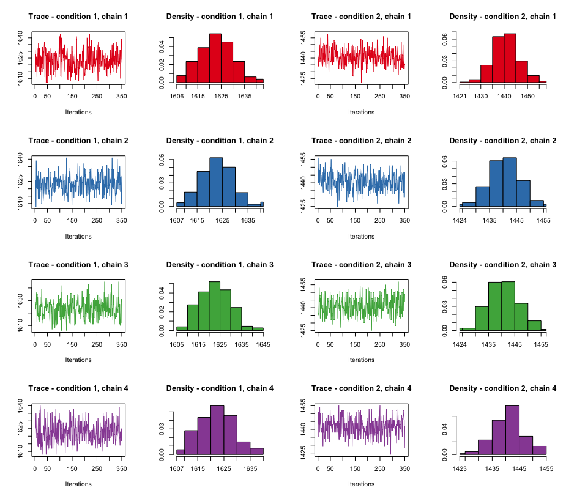

```{r style, echo = FALSE, results = 'asis'}
BiocStyle::markdown()
```

```{r setup, include=FALSE}
knitr::opts_chunk$set(dpi=40,fig.width=7)
```

# Introduction

In this vignette we use a real-life biological use-case to demonstrate how to
analyse mass-spectrometry based proteomics data using the Bayesian ANalysis of
Differential Localisation Experiments (BANDLE) method.

# The data

As mentioned in "Vignette 1: Getting Started with BANDLE" data from mass
spectrometry based proteomics methods most commonly yield a matrix of
measurements where we have proteins/peptides/peptide spectrum matches
(PSMs) along the rows, and samples/fractions along the columns. To use `bandle`
the data must be stored as a `MSnSet`, as implemented in the Bioconductor 
`r Biocpkg("MSnbase")` package. Please see the relevant vignettes in 
`r Biocpkg("MSnbase")` for constructing these data containers.

The data used in this vignette has been published in @thplopit and is currently
stored as `MSnSet` instances in the the `r Biocpkg("pRolocdata")` package. We
will load it in the next section.

## Spatialtemporal proteomic profiling of a THP-1 cell line

In this workflow we analyse the data produced by @thplopit. In this experiment
triplicate hyperLOPIT experiments [@Mulvey:2017] were conducted on THP-1 human
leukaemia cells where the samples were analysed and collected (1) when cells
were unstimulated and then (2) following 12 hours stimulation with LPS
(12h-LPS).

In the following code chunk we load 4 of the datasets from the study: 2
replicates of the unstimulated and 2 replicates of the 12h-LPS stimulated
samples. Please note to adhere to Bioconductor vignette build times we only load
2 of the 3 replicates for each condition to demonstrate the BANDLE workflow.

```{r loaddata, message=FALSE}
library("pRolocdata")
data("thpLOPIT_unstimulated_rep1_mulvey2021")
data("thpLOPIT_unstimulated_rep3_mulvey2021")
data("thpLOPIT_lps_rep1_mulvey2021")
data("thpLOPIT_lps_rep3_mulvey2021")
```

By typing the names of the datasets we get a `MSnSet` data summary. For
example,

```{r summarydata}
thpLOPIT_unstimulated_rep1_mulvey2021
thpLOPIT_lps_rep1_mulvey2021
```

We see that the datasets `thpLOPIT_unstimulated_rep1_mulvey2021` and
`thpLOPIT_lps_rep1_mulvey2021` contain 5107 and 4879 proteins respectively,
across 20 TMT channels. The data is accessed through different slots of the
`MSnSet` (see `str(thpLOPIT_unstimulated_rep1_mulvey2021)` for all available
slots). The 3 main slots which are used most frequently are those that contain
the quantitation data, the features i.e. PSM/peptide/protein information and the
sample information, and these can be accessed using the functions `exprs`,
`fData`, and `pData`, respectively.

## Preparing the data

First, let us load the `bandle` package along with some other R packages needed
for visualisation and data manipulation,

```{r ldpkg, message=FALSE}
library("bandle")
library("pheatmap")
library("viridis")
library("dplyr")
library("ggplot2")
library("gridExtra")
```

To run `bandle` there are a few minimal requirements that the data must fulfill.

- the same number of channels across conditions and replicates
- the same proteins across conditions and replicates
- data must be a `list` of `MSnSet` instances

If we use the `dim` function we see that the datasets we have loaded have the
same number of channels but a different number of proteins per experiment.

```{r datadim}
dim(thpLOPIT_unstimulated_rep1_mulvey2021)
dim(thpLOPIT_unstimulated_rep3_mulvey2021)
dim(thpLOPIT_lps_rep1_mulvey2021)
dim(thpLOPIT_lps_rep3_mulvey2021)
```

We use the function `commonFeatureNames` to extract proteins that are common
across all replicates. This function has a nice side effect which is that it
also wraps the data into a `list`, ready for input into `bandle`.


```{r cmnprots}
thplopit <- commonFeatureNames(c(thpLOPIT_unstimulated_rep1_mulvey2021,  ## unstimulated rep
                                 thpLOPIT_unstimulated_rep3_mulvey2021,  ## unstimulated rep
                                 thpLOPIT_lps_rep1_mulvey2021,           ## 12h-LPS rep
                                 thpLOPIT_lps_rep3_mulvey2021))          ## 12h-LPS rep
```

We now have our list of `MSnSet`s ready for `bandle` with 3727 proteins common
across all 4 replicates/conditions.

```{r listmsnsets}
thplopit
```

We can visualise the data using the `plot2D` function from `pRoloc`

```{r exampledata, fig.height=10, fig.width=10}
## create a character vector of title names for the plots
plot_id <- c("Unstimulated replicate 1", "Unstimulated replicate 2",
             "12h-LPS replicate 1", "12h-LPS replicate 2")

## Let's set the stock colours of the classes to plot to be transparent
setStockcol(NULL)
setStockcol(paste0(getStockcol(), "90"))

## plot the data
par(mfrow = c(2,2))
for (i in seq(thplopit))
    plot2D(thplopit[[i]], main = plot_id[i])
addLegend(thplopit[[4]], where = "topleft", cex = .75)
```

By default the `plot2D` uses principal components analysis (PCA)
for the data transformation. Other options such as t-SNE, kernal
PCA etc. are also available, see `?plot2D` and the `method` argument.
PCA sometimes will randomly flip the axis, because the eigenvectors 
only need to satisfy $||v|| = 1$, which allows a sign flip. You will
notice this is the case for the 3rd plot. If desired you can flip
the axis/change the sign of the PCs by specifying any of the arguments
`mirrorX`, `mirrorY`, `axsSwitch` to TRUE when you call `plot2D`.

Data summary:

- LOPIT conducted on THP1 leukaemia cells
- 2 conditions: (1) unstimulated, (2) 12 hours stimulation with THP
- 20 TMT fractions yielded from 2 x 10plex TMT in an interleaved experimental design (see @Mulvey:2017 for details and the associated app http://proteome.shinyapps.io/thp-lopit/)
- 2 replicates selected as a use-case from the original experiment
- 3727 proteins common across the 2 replicates

# Preparing the bandle input parameters

As mentioned in the first vignette, `bandle` uses a complex model to analyse the
data. Markov-Chain Monte-Carlo (MCMC) is used to sample the posterior
distribution of parameters and latent variables from which statistics of
interest can be computed. Again, here we only run a few iterations for brevity
but typically one needs to run thousands of iterations to ensure convergence, as
well as multiple parallel chains.

## Fitting Gaussian processes

First, we need to fit non-parametric regression functions to the markers
profiles. We use the function `fitGPmaternPC`. In general the default penalised
complexity priors on the hyperparameters (see `?fitGP`), of `fitGPmaternPC` work
well for correlation profiling data with <10 channels (as tested in @bandle).
From looking at the help documentation (see, `?fitGPmaternPC`) we see the
default priors on the hyperparameters are 
`hyppar = matrix(c(10, 60, 250), nrow = 1)`.

Different priors can be constructed and tested. For example, here, we found that
`matrix(c(1, 60, 100)` worked well. In this experiment we have with several
thousand proteins and many more subcellular classes and fractions (channels)
than tested in the @bandle paper.

In this example, we require a `11*3` matrix as we have 11 subcellular marker
classes and 3 columns to represent the hyperparameters length-scale, amplitude,
variance. Generally, (1) increasing the lengthscale parameter (the first column
of the `hyppar` matrix) increases the spread of the covariance i.e. the
similarity between points, (2) increasing the amplitude parameter (the second
column of the `hyppar` matrix) increases the maximum value of the covariance and
lastly (3) decreasing the variance (third column of the `hyppar` matrix) reduces
the smoothness of the function to allow for local variations. We strongly
recommend users start with the default parameters and change and assess them as
necessary for their dataset by visually evaluating the fit of the GPs using the
`plotGPmatern` function.

To see the subcellular marker classes in our data we use the 
`getMarkerClasses` function from `pRoloc`.

```{r lengthmrk}
(mrkCl <- getMarkerClasses(thplopit[[1]], fcol = "markers"))
```

For this use-case we have `K = 11` classes

```{r}
K <- length(mrkCl)
```

We can construct our priors, which as mentioned above will be a `K*3` matrix i.e.
`11x3` matrix.

```{r sethyppar}
pc_prior <- matrix(NA, ncol = 3, K)
pc_prior[seq.int(1:K), ] <- matrix(rep(c(1, 60, 100),
                                       each = K), ncol = 3)
head(pc_prior)
```

Now we have generated these complexity priors we can pass them as an
argument to the `fitGPmaternPC` function. For example,

```{r runhyppar}
gpParams <- lapply(thplopit,
                   function(x) fitGPmaternPC(x, hyppar = pc_prior))
```

By plotting the predictives using the `plotGPmatern` function we see that
the distributions and fit looks sensible for each class so we will proceed with
setting the prior on the weights.

```{r plotgps, fig.height=10, fig.width=10}
par(mfrow = c(4, 3))
plotGPmatern(thplopit[[1]], gpParams[[1]])
```

For the interest of keeping the vignette size small, in the above chunk we
plot only the first dataset and its respective predictive. To plot the
second dataset we would execute `plotGPmatern(thplopit[[i]], gpParams[[i]])`
where i = 2, and similarly for the third i = 3 and so on.

## Setting the prior on the weights

The next step is to set up the matrix Dirichlet prior on the mixing weights.
If `dirPrior = NULL` a default Dirichlet prior is computed see `?bandle`. We
strongly advise you to set your own prior. In "Vignette 1: Getting Started with
BANDLE" we give some suggestions on how to set this and in the below code we try
a few different priors and assess the expectations.

As per Vignette 1, let's try a `dirPrior` as follows,

```{r setweightprior}
set.seed(1)
dirPrior = diag(rep(1, K)) + matrix(0.001, nrow = K, ncol = K)
predDirPrior <- prior_pred_dir(object = thplopit[[1]],
                               dirPrior = dirPrior,
                               q = 15)
```

The mean number of relocalisations is
```{r}
predDirPrior$meannotAlloc
```

The prior probability that more than `q` differential localisations are
expected is
```{r}
predDirPrior$tailnotAlloc
```

```{r, fig.height=3, fig.width=4}
hist(predDirPrior$priornotAlloc, col = getStockcol()[1])
```

We see that the prior probability that proteins are allocated to different
components between datasets concentrates around 0. This is what we expect, we
expect subtle changes between conditions for this data. We may perhaps wish to
be a little stricter with the number of differential localisations output by
`bandle` and in this case we could make the off-diagonal elements of the
`dirPrior` smaller. In the below code chunk we test 0.0005 instead of 0.001,
which reduces the number of re-localisations.


```{r try, fig.height=3, fig.width=4}
set.seed(1)
dirPrior = diag(rep(1, K)) + matrix(0.0005, nrow = K, ncol = K)
predDirPrior <- prior_pred_dir(object = thplopit[[1]],
                               dirPrior = dirPrior,
                               q = 15)

predDirPrior$meannotAlloc
predDirPrior$tailnotAlloc
hist(predDirPrior$priornotAlloc, col = getStockcol()[1])
```

Again, we see that the prior probability that proteins are allocated to different
components between datasets concentrates around 0. 

# Running bandle

Now we have computed our `gpParams` and `pcPriors` we can run the main `bandle`
function.

Here for convenience of building the vignette we only run 2 of the triplicates
for each condition and run the `bandle` function for a small number of
iterations and chains to minimise the vignette build-time. Typically we'd
recommend you run the number of iterations (`numIter`) in the $1000$s and to
test a minimum of 4 chains.

We first subset our data into two objects called `control` and `treatment`
which we subsequently pass to `bandle` along with our priors.

```{r runbandle, message=FALSE}
control <- list(thplopit[[1]], thplopit[[2]])
treatment <- list(thplopit[[3]], thplopit[[4]])

params <- bandle(objectCond1 = control, 
                 objectCond2 = treatment,
                 numIter = 10,       # usually 10,000
                 burnin = 5L,        # usually 5,000
                 thin = 1L,          # usually 20
                 gpParams = gpParams,
                 pcPrior = pc_prior,
                 numChains = 4,     # usually >=4
                 dirPrior = dirPrior,
                 seed = 1)
```

- `numIter` is the number of iterations of the MCMC algorithm. Default is 1000. 
Though usually much larger numbers are used we recommend 10000+.
- `burnin` is the number of samples to be discarded from the beginning of the 
chain. Here we use 5 in this example but the default is 100.
- `thin` is the thinning frequency to be applied to the MCMC chain. Default is 
5.
- `gpParams` parameters from prior fitting of GPs to each niche to accelerate 
inference
- `pcPrior` matrix with 3 columns indicating the lambda parameters for the 
penalised complexity prior.
- `numChains` defined the number of chains to run. We recommend at least 4.
- `dirPrior` as above a matrix generated by dirPrior function.
- `seed` a random seed for reproducibility


A `bandleParams` object is produced

```{r}
params
```


# Processing and analysing the bandle results

## Assessing convergence

The `bandle` method uses of Markov Chain Monte Carlo (MCMC) and therefore
before we can extract our classification and differential localisation
results we first need to check the algorithm for convergence of the MCMC chains. 

As mentioned in Vignette 1 there are two main functions we can use to help us
assess convergence are: (1) `calculateGelman` which calculates the Gelman
diagnostics for all pairwise chain combinations and (2) `plotOutliers` which
generates trace and density plots for all chains.

Let's start with the Gelman which allows us to compare the inter and intra chain
variances. If the chains have converged the ratio of these quantities should be
close to one. 

```{r gelman}
calculateGelman(params)
```

In this example, to demonstrate how to use `bandle` we have only run 10 MCMC 
iterations for each of the `r length(params@chains)` chains. As 
already mentioned in practice we suggest running a minimum of 1000 iterations
and a minimum of 4 chains. 

We do not expect the algorithm to have converged with so little iterations and 
this is highlighted in the Gelman diagnostics which are > 1. For convergence
we expect Gelman diagnostics < 1.2, as discuss in @Crook2019 and general
Bayesian literature.

If we plot trace and density plots we can also very quickly see that (as
expected) the algorithm has **not** converged over the 20 test runs. 

**Example with 5 iterations**

```{r tracedens, fig.height=8, fig.width=8}
plotOutliers(params)
```

We include a plot below of output from 500 iterations

**Example with 500 iterations**

```{r pressure, echo=FALSE, fig.cap="", out.width = "100%"}

```

In this example where the data has been run for 500 iterations. We get a better
idea of what we expect convergence to look like. We would still recommend
running for 10000+ iterations for adequate sampling. For convergence we expect
trace plots to look like hairy caterpillars and the density plots should be
centered around the same number of outliers. For condition 1 we see the number
of outliers sits around 1620 proteins and in condition 2 it sits around 1440. If
we the number of outliers was wildly different for one of the chains, or if the
trace plot has a long period of burn-in (the beginning of the trace looks very
different from the rest of the plot), or high serial correlation (the chain is
very slow at exploring the sample space) we may wish to discard these chains. We
may need to run more chains.

@Taboga2021 provides a nice online book  explaining some of the main
problems users may encounter with MCMC at, see the chapter ["Markov-Chain-Monte-Carlo-diagnostics"](https://www.statlect.com/fundamentals-of-statistics/Markov-Chain-Monte-Carlo-diagnostics.)

## Removing unconverged chains
Although we can clearly see all chains in the example with 5 iterations are bad
here as we have not sampled the space with sufficient number of iterations to
achieve convergence, let's for sake of demonstration remove chains 1 and 4. In
practice, all of these chains would be discarded as (1) none of the trace and
density plots show convergence and additionally (2) the Gelman shows many chains
have values > 1. Note, when assessing convergence if a chain is bad in one
condition, the same chain must be discarded from the second condition too. They
are considered in pairs.

Let's remove chains 1 and 4 as an example,

```{r rmchains}
params_converged <- params[-c(1, 4)]
```

We have now removed chains 1 and 4 and we are left with 2 chains

```{r viewnew}
params_converged
```

## Running `bandleProcess` and `bandleSummary`

Following Vignette 1 we populate the `bandleres` object by calling the
`bandleProcess` function. This may take a few seconds to process.

```{r processbandle}
params_converged <- bandleProcess(params_converged)
```

The `bandleProcess` must be run to process the bandle output and populate the
`bandle` object.

The `summaries` function is a convenience function for accessing the output

```{r}
bandle_out <- summaries(params_converged)
```

The output is a `list` of 2 `bandleSummary` objects.

```{r}
length(bandle_out)
class(bandle_out[[1]])
```

There are 3 slots:

-  A `posteriorEstimates` slot containing the posterior quantities of interest for
different proteins. 
- A slot for convergence diagnostics
- The joint posterior distribution across organelles see `bandle.joint`

For the control we would access these as follows,

```{r, results = "hide"}
bandle_out[[1]]@posteriorEstimates
bandle_out[[1]]@diagnostics
bandle_out[[1]]@bandle.joint
```

Instead of examining these directly we are going to proceed with protein 
localisation prediction and add these results to the datasets in the `fData`
slot of the `MSnSet`.

# Predicting subcellular location

The `bandle` method performs both (1) protein subcellular localisation
prediction and (2) predicts the differential localisation of proteins. In this
section we will use the `bandlePredict` function to perform protein subcellular
localisation prediction and also append all the `bandle` results to the `MSnSet`
dataset.

We begin by using the `bandlePredict` function to append our results to the
original `MSnSet` datasets.

```{r predictlocation}
## Add the bandle results to a MSnSet
xx <- bandlePredict(control, 
                    treatment, 
                    params = params_converged, 
                    fcol = "markers")
res_0h <- xx[[1]]
res_12h <- xx[[2]]
```

The BANDLE model combines replicate information within each condition to obtain
the localisation of proteins for each single experimental condition.

The results for each condition are appended to the *first* dataset in the list
of `MSnSets` (for each condition). It is important to familiarise yourself with
the `MSnSet` data structure. To further highlight this in the below code chunk
we look at the `fvarLabels` of each datasets, this shows the column header names
of the `fData` feature data. We see that the first replicate at 0h e.g.
`res_0h[[1]]` has 7 columns updated with the output of `bandle` e.g.
`bandle.probability`, `bandle.allocation`, `bandle.outlier` etc. appended to the
feature data (`fData(res_0h[[1]])`). 

The second dataset at 0h i.e. `res_0h[[2]]` does not have this information
appended to the feature data as it is already in the first dataset. This is the
same for the second condition at 12h post LPS stimulation.

```{r showappended, eval=FALSE}
fvarLabels(res_0h[[1]])
fvarLabels(res_0h[[2]])

fvarLabels(res_12h[[1]])
fvarLabels(res_12h[[2]])
```

The `bandle` results are shown in the columns:

- `bandle.joint` which is the full joint probability distribution across all
subcellular classes
- `bandle.allocation` which contains the the localisation predictions to one of the
subcellular classes that appear in the training data.
- `bandle.probability` is the allocation probability, corresponding to the mean
of the distribution probability.
- `bandle.outlier` is the probability of being an outlier. A high value
indicates that the protein is unlikely to belong to any annotated class (and is
hence considered an outlier).
- `bandle.probability.lowerquantile` and `bandle.probability.upperquantile` are
the upper and lower quantiles of the allocation probability distribution.
- `bandle.mean.shannon` is the Shannon entropy, measuring the uncertainty in the
allocations (a high value representing high uncertainty; the highest value is
the natural logarithm of the number of classes).
- `bandle.differential.localisation` is the differential localisation probability.

## Thresholding on the posterior probability

As mentioned in Vignette 1, it is also common to threshold allocation results
based on the posterior probability. Proteins that do not meet the threshold are
not assigned to a subcellular location and left unlabelled (here we use the
terminology "unknown" for consistency with the `pRoloc` package). It is
important not to force proteins to allocate to one of the niches defined here in
the training data, if they have low probability to reside there. We wish to
allow for greater subcellular diversity and to have multiple location, this is
captured essentially in leaving a protein "unlabelled" or "unknown". We can also
extract the "unknown" proteins with high uncertainty and examine their
distribution over all organelles (see `bandle.joint`).

To obtain classification results we threshold using a 1% FDR based on the
`bandle.probability` and append the results to the data using the
`getPredictions` function from `MSnbase`.

```{r thresholddata}
## threshold results using 1% FDR
res_0h[[1]] <- getPredictions(res_0h[[1]], 
                              fcol = "bandle.allocation",  
                              scol = "bandle.probability",    
                              mcol = "markers", 
                              t = .99)

res_12h[[1]] <- getPredictions(res_12h[[1]], 
                               fcol = "bandle.allocation",
                               scol = "bandle.probability", 
                               mcol = "markers",      
                               t = .99)
```

A table of predictions is printed to the screen as a side effect when running
`getPredictions` function.

In addition to thresholding on the `bandle.probability` we can threshold based
on the `bandle.outlier` i.e. the probability of being an outlier. A high value
indicates that the protein is unlikely to belong to any annotated class (and is
hence considered an outlier). We wish to assign proteins to a subcellular niche
if they have a high `bandle.probability` and also a low `bandle.outlier`
probability. This is a nice way to ensure we keep the most high confidence
localisations.

In the below code chunk we use first create a new column called
`bandle.outlier.t` in the feature data which is `1 - outlier probability`. This
allows us then to use `getPredictions` once again and keep only proteins which
meet both the 0.99 threshold on the `bandle.probability` and the
`bandle.outlier`.

Note, that running `getPredictions` appends the results to a new feature data
column called `fcol.pred`, please see `?getPredictions` for the documentation.
As we have run this function twice, our column of classification results are
found in `bandle.allocation.pred.pred`.

```{r threshold2}
## add outlier probability
fData(res_0h[[1]])$bandle.outlier.t <- 1 -  fData(res_0h[[1]])$bandle.outlier
fData(res_12h[[1]])$bandle.outlier.t <- 1 -  fData(res_12h[[1]])$bandle.outlier

## threshold again, now on the outlier probability
res_0h[[1]] <- getPredictions(res_0h[[1]], 
                              fcol = "bandle.allocation.pred",  
                              scol = "bandle.outlier.t",    
                              mcol = "markers", 
                              t = .99)

res_12h[[1]] <- getPredictions(res_12h[[1]], 
                               fcol = "bandle.allocation.pred",
                               scol = "bandle.outlier.t", 
                               mcol = "markers",      
                               t = .99)
```


**Appending the results to all replicates**

Let's append the results to the second replicate (by default they are appended
to the first only, as already mentioned above). This allows us to plot each
dataset and the results using `plot2D`.

```{r appendtosecond}
## Add results to second replicate at 0h
res_alloc_0hr <- fData(res_0h[[1]])$bandle.allocation.pred.pred
fData(res_0h[[2]])$bandle.allocation.pred.pred <- res_alloc_0hr

## Add results to second replicate at 12h
res_alloc_12hr <- fData(res_12h[[1]])$bandle.allocation.pred.pred
fData(res_12h[[2]])$bandle.allocation.pred.pred <- res_alloc_12hr
```

We can plot these results on a PCA plot and compare to the original subcellular
markers.

```{r plotmyres, fig.height=14, fig.width=5}
par(mfrow = c(5, 2))

plot2D(res_0h[[1]], main = "Unstimulated - replicate 1 \n subcellular markers", 
       fcol = "markers")
plot2D(res_0h[[1]], main = "Unstimulated - replicate 1 \nprotein allocations (1% FDR)", 
       fcol = "bandle.allocation.pred.pred")

plot2D(res_0h[[2]], main = "Unstimulated - replicate 2 \nsubcellular markers", 
       fcol = "markers")
plot2D(res_0h[[2]], main = "Unstimulated - replicate 2 \nprotein allocations (1% FDR)", 
       fcol = "bandle.allocation.pred.pred")

plot2D(res_0h[[1]], main = "12h LPS - replicate 1 \nsubcellular markers", 
       fcol = "markers")
plot2D(res_0h[[1]], main = "12h LPS - replicate 1 \nprotein allocations (1% FDR)", 
       fcol = "bandle.allocation.pred.pred")

plot2D(res_0h[[2]], main = "12h LPS - replicate 2 \nsubcellular markers", 
       fcol = "markers")
plot2D(res_0h[[2]], main = "12h LPS - replicate 2 \nprotein allocations (1% FDR)", 
       fcol = "bandle.allocation.pred.pred")

plot(NULL, xaxt='n',yaxt='n',bty='n',ylab='',xlab='', xlim=0:1, ylim=0:1)
addLegend(res_0h[[1]], where = "topleft", cex = .8)
```

## Distribution on allocations

We can examine the distribution of allocations that (1) have been assigned to a
single location with high confidence and, (2) those which did not meet the
threshold and thus have high uncertainty i.e. are labelled as "unknown".

Before we can begin to examine the distribution of allocation we first need 
to subset the data and remove the markers. This makes it easier to assess
new prediction. 

We can use the function `unknownMSnSet` to subset as we did in Vignette 1,

```{r}
## Remove the markers from the MSnSet
res0hr_unknowns <- unknownMSnSet(res_0h[[1]], fcol = "markers")
res12h_unknowns <- unknownMSnSet(res_12h[[1]], fcol = "markers")
```

### Proteins assigned to one main location

In this example we have performed an extra round of filtering when predicting
the main protein subcellular localisation by taking into account outlier
probability in addition to the posterior. As such, the column containing the
predictions in the `fData` is called `bandle.allocation.pred.pred`.

Extract the predictions,

```{r}
res1 <- fData(res0hr_unknowns)$bandle.allocation.pred.pred
res2 <- fData(res12h_unknowns)$bandle.allocation.pred.pred

res1_tbl <- table(res1)
res2_tbl <- table(res2)
```

We can visualise these results on a barplot,

```{r, fig.height=4, fig.width=8}
par(mfrow = c(1, 2))
barplot(res1_tbl, las = 2, main = "Predicted location: 0hr",
        ylab = "Number of proteins")
barplot(res2_tbl, las = 2, main = "Predicted location: 12hr",
        ylab = "Number of proteins")
```

The barplot tells us for this example that after thresholding with a 1% FDR on
the posterior probability `bandle` has allocated many new proteins to
subcellular classes in our training data but also many are still left with no
allocation i.e. they are labelled as "unknown". As previously mentioned the
class label "unknown" is a historic term from the `pRoloc` package to describe
proteins that are left unassigned following thresholding and thus proteins which
exhibit uncertainty in their allocations and thus potential proteins of mixed
location.

The associated posterior estimates are located in the `bandle.probability`column
and we can construct a `boxplot` to examine these probabilities by class,

```{r allocspost, fig.height=4, fig.width=8}
pe1 <- fData(res0hr_unknowns)$bandle.probability
pe2 <- fData(res12h_unknowns)$bandle.probability

par(mfrow = c(1, 2))
boxplot(pe1 ~ res1, las = 2, main = "Posterior: control",
        ylab = "Probability")
boxplot(pe2 ~ res2, las = 2, main = "Posterior: treatment",
        ylab = "Probability")
```

We see proteins in the "unknown" "unlabelled" category with a range of different
probabilities. We still have several proteins in this category with a high
probability, it is likely that proteins classed in this category also have a
high outlier probability.

### Proteins with uncertainty

We can use the `unknownMSnSet` function once again to extract proteins in the 
"unknown" category.

```{r}
res0hr_mixed <- unknownMSnSet(res0hr_unknowns, fcol = "bandle.allocation.pred.pred")
res12hr_mixed <- unknownMSnSet(res12h_unknowns, fcol = "bandle.allocation.pred.pred")
```

We see we have `r nrow(res0hr_mixed)` and `r nrow(res12hr_mixed)`
proteins for the 0hr and 12hr conditions respectively, which do not get assigned
one main location. This is approximately 40% of the data.

```{r}
nrow(res0hr_mixed)
nrow(res12hr_mixed)
```

Let's extract the names of these proteins,

```{r}
fn1 <- featureNames(res0hr_mixed)
fn2 <- featureNames(res12hr_mixed)
```

Let's plot the the first 9 proteins that did not meet the thresholding criteria.
We can use the `mcmc_plot_probs` function to generate a violin plot of the 
localisation distribution.

Let's first look at these proteins in the control condition,

```{r plot_mixed, fig.height=10, fig.width=10}
g <- vector("list", 9)
for (i in 1:9) g[[i]] <- mcmc_plot_probs(params_converged, fn1[i], cond = 1)
do.call(grid.arrange, g)
```

Now the treated,

```{r plot_mixed2, fig.height=10, fig.width=10}
g <- vector("list", 9)
for (i in 1:9) g[[i]] <- mcmc_plot_probs(params_converged, fn1[i], cond = 2)
do.call(grid.arrange, g)
```

We can also get a summary of the full probability distribution by looking at the 
joint estimates stored in the `bandle.joint` slot of the `MSnSet`. 


```{r}
head(fData(res0hr_mixed)$bandle.joint)
```

Or visualise the joint posteriors on a heatmap

```{r heatmap_control}
bjoint_0hr_mixed <- fData(res0hr_mixed)$bandle.joint
pheatmap(bjoint_0hr_mixed, cluster_cols = FALSE, color = viridis(n = 25), 
         show_rownames = FALSE, main = "Joint posteriors for unlabelled proteins at 0hr")
```

```{r heatmap_treatment}
bjoint_12hr_mixed <- fData(res12hr_mixed)$bandle.joint
pheatmap(bjoint_12hr_mixed, cluster_cols = FALSE, color = viridis(n = 25),
         show_rownames = FALSE, main = "Joint posteriors for unlabelled proteins at 12hr")
```

# Differential localisation

The differential localisation probability tells us which proteins are most
likely to *differentially localise*, that exhibit a change in their steady-state
subcellular location. Quantifying changes in protein subcellular location
between experimental conditions is challenging and Crook et al [@bandle] have
used a Bayesian approach to compute the probability that a protein
differentially localises upon cellular perturbation, as well quantifying the
uncertainty in these estimates. The differential localisation probability is
found in the `bandle.differential.localisation` column of the `MSnSet` or can
be extracted directly with the `diffLocalisationProb` function.

```{r}
dl <- diffLocalisationProb(params_converged)
head(dl)
```

If we take a 5% FDR and examine how many proteins get a differential probability
greater than 0.95 we find there are 
`r length(which(dl[order(dl, decreasing = TRUE)] > 0.99))` 
proteins above this threshold.

```{r cutoffres}
length(which(dl[order(dl, decreasing = TRUE)] > 0.95))
```

On a rank plot we can see the distribution of differential probabilities.
                 
```{r extractdifflocp, fig.height=4, fig.width=6}
plot(dl[order(dl, decreasing = TRUE)],
     col = getStockcol()[2], pch = 19, ylab = "Probability",
     xlab = "Rank", main = "Differential localisation rank plot")
```

This indicated that most proteins are not differentially localised and there are a
few hundred confident differentially localised proteins of interest. 

```{r}
candidates <- names(dl)
```

## Visualising differential localisation

There are several different ways we can visualise the output of `bandle`. Now we
have our set of candidates we can subset `MSnSet` datasets and plot the the
results.

To subset the data, 
```{r alluvial, warning=FALSE, message=FALSE}
msnset_cands <- list(res_0h[[1]][candidates, ], 
                     res_12h[[1]][candidates, ])
```

We can visualise this as a `data.frame` too for ease,

```{r dataframeres}
# construct data.frame
df_cands <- data.frame(
    fData(msnset_cands[[1]])[, c("bandle.differential.localisation", 
                                 "bandle.allocation.pred.pred")],
    fData(msnset_cands[[2]])[, "bandle.allocation.pred.pred"])

colnames(df_cands) <- c("differential.localisation", 
                        "0hr_location", "12h_location")

# order by highest differential localisation estimate
df_cands <- df_cands %>% arrange(desc(differential.localisation))
head(df_cands)
```

### Alluvial plots

We can now plot this on an alluvial plot to view the changes in subcellular
location. The class label is taken from the column called
`"bandle.allocation.pred.pred"` which was deduced above by thresholding on the
posterior and outlier probabilities before assigning BANDLE's allocation
prediction.

```{r plotres, fig.height=8, fig.width=8}
## set colours for organelles and unknown
cols <- c(getStockcol()[seq(mrkCl)], "grey")
names(cols) <- c(mrkCl, "unknown")

## plot
alluvial <- plotTranslocations(msnset_cands, 
                               fcol = "bandle.allocation.pred.pred", 
                               col = cols)
alluvial + ggtitle("Differential localisations following 12h-LPS stimulation")
```

To view a table of the translocations, we can call the function `plotTable`,

```{r tbllocs}
(tbl <- plotTable(msnset_cands, fcol = "bandle.allocation.pred.pred"))
```

Although this example analysis is limited compared to that of @thplopit, we do
see similar trends inline with the results seen in the paper. For examples, we
see a large number of proteins translocating between organelles that are
involved in the secretory pathway. We can further examine these cases by
subsetting the datasets once again and only plotting proteins that involve
localisation with these organelles. Several organelles are known to be involved 
in this pathway, the main ones, the ER, Golgi (and plasma membrane). 

Let's subset for these proteins,

```{r plotlysos, fig.height=8, fig.width=8}
secretory_prots <- unlist(lapply(msnset_cands, function(z) 
    c(which(fData(z)$bandle.allocation.pred.pred == "Golgi Apparatus"),
      which(fData(z)$bandle.allocation.pred.pred == "Endoplasmic Reticulum"),
      which(fData(z)$bandle.allocation.pred.pred == "Plasma Membrane"),
      which(fData(z)$bandle.allocation.pred.pred == "Lysosome"))))
secretory_prots <- unique(secretory_prots)

msnset_secret <- list(msnset_cands[[1]][secretory_prots, ],
                      msnset_cands[[2]][secretory_prots, ])

secretory_alluvial <- plotTranslocations(msnset_secret, 
                                         fcol = "bandle.allocation.pred.pred", 
                                         col = cols)
secretory_alluvial + ggtitle("Movements of secretory proteins")
```

### Protein profiles

In the next section we see how to plot proteins of interest. Our differential
localisation candidates can be found in `df_cands`,

```{r plotdfprof}
head(df_cands)
```

We can probe this `data.frame` by examining proteins with high differential 
localisation probabilites. For example, protein with accession B2RUZ4. It
has a high differential localisation score and it's steady state localisation in
the control is predicted to be lysosomal and in the treatment condition at 12
hours-LPS it is predicted to localise to the plasma membrane. This fits with the
information we see on Uniprot which tells us it is Small integral membrane
protein 1 (SMIM1).

In the below code chunk we plot the protein profiles of all proteins that were
identified as lysosomal from BANDLE in the control and then overlay SMIM1. We do
the same at 12hrs post LPS with all plasma membrane proteins.

```{r protprof, fig.height=7, fig.width=8}
par(mfrow = c(2, 1))

## plot lysosomal profiles
lyso <- which(fData(res_0h[[1]])$bandle.allocation.pred.pred == "Lysosome")
plotDist(res_0h[[1]][lyso], pcol = cols["Lysosome"], alpha = 0.04)
matlines(exprs(res_0h[[1]])["B2RUZ4", ], col = cols["Lysosome"], lwd = 3)
title("Protein SMIM1 (B2RUZ4) at 0hr (control)")

## plot plasma membrane profiles
pm <- which(fData(res_12h[[1]])$bandle.allocation.pred.pred == "Plasma Membrane")
plotDist(res_12h[[1]][pm], pcol = cols["Plasma Membrane"], alpha = 0.04)
matlines(exprs(res_12h[[1]])["B2RUZ4", ], col = cols["Plasma Membrane"], lwd = 3)
title("Protein SMIM1 (B2RUZ4) at 12hr-LPS (treatment)")
```

We can also visualise there on a PCA or t-SNE plot.

```{r plotpcacands, fig.height=6, fig.width=9}
par(mfrow = c(1, 2))
plot2D(res_0h[[1]], fcol = "bandle.allocation.pred.pred",
       main = "Unstimulated - replicate 1 \n predicted location")
highlightOnPlot(res_0h[[1]], foi = "B2RUZ4")

plot2D(res_12h[[1]], fcol = "bandle.allocation.pred.pred",
       main = "12h-LPS - replicate 1 \n predicted location")
highlightOnPlot(res_12h[[1]], foi = "B2RUZ4")
```


# Session information

All software and respective versions used to produce this document are listed below.
```{r sessionInfo}
sessionInfo()
```

# References {-}
